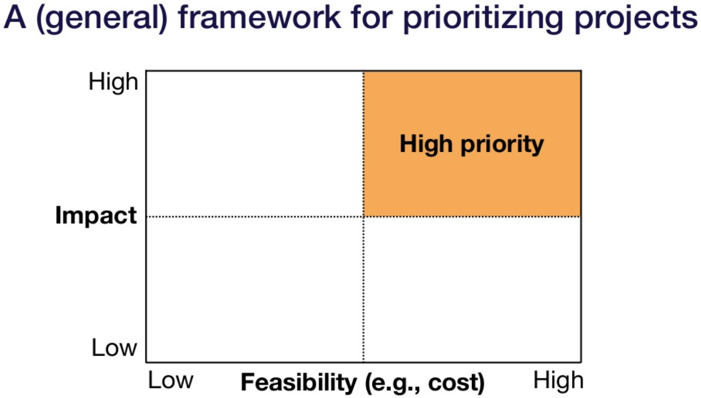

# Prioritizing

Đây là phần 2 và mình đang thử viết tiếng việc

* The project should have high impact, where cheap prediction is valuable for the complex parts of your business process.
* The project should have high feasibility, which is driven by the data availability, accuracy requirements, and problem difficulty.
* Here are 3 types of hard machine learning problems:
    * (1) The output is complex.
    * (2) Reliability is required.
    * (3) Generalization is expected.

Đây là phần mà mình làm rõ nội dung

Cách suy nghĩ về việc ưu tiên các dự án, kiểu dự án này có khả thi không và liệu nó có đáng để thực hiện trong thời gian hiện tại.

Để 1 dự án được chạy chúng ta luôn để tâm đến sự khả thi của dự án. Dự án luôn sẽ quan tâm đến yếu tố hiệu quả được đánh giá qua times cost price 

Nên 1 dự án mơ hồ nói chung đều không khả thi

Để xem xét tính khả thi về mặc công nghệ trong ml thì t nên xét trên hệ số hiệu quả từ các nguyên cứu thường sẽ có 1 ngưỡng để công nghệ từ lý thuyết đi thẳng vào thực sản phẩm

1. The project should have high impact, where cheap prediction is valuable for the complex parts of your business process.
2. The project should have high feasibility, which is driven by the data availability, accuracy requirements, and problem difficulty.
- High-impact ML problems
    - Complex parts of your pipeline
    - Places where cheap prediction is valuable
- Cost of ML projects is driven by data availability, but accuracy requirement also plays a big role.

- Here are 3 types of hard machine learning problems:
    - (1) The output is complex.
    - (2) Reliability is required.
    - (3) Generalization is expected.

    

     Mental models for high-impact ML projects

    1. Where can you take advantage of cheap prediction?
    2. Where can you automate complicated manual processes?

    The economics of AI (Agrawal, Gans, Goldfarb)

    - AI reduces cost of prediction
    - Prediction is central for decision making
    - Cheap prediction means
        - Prediction will be everywhere
        - Even in problems where it was too expensive before (e.g., for most people. hiring a driver)
    - Implication: Look for projects where cheap prediction will have a huge business impact

    ## software 2.0

    - Software 1.0 = traditional programs with explicit instructions (Python/ c++)
    - Software 2.0 = humans specify goals, and algorithm searches for program that works
    - 2.0 programmers work with datasets, which get complied via optimization
    - Why? Works better, more general, computational advantages
    - Implication: look for complicated rule-based software where we can learn the rules instead of programming them